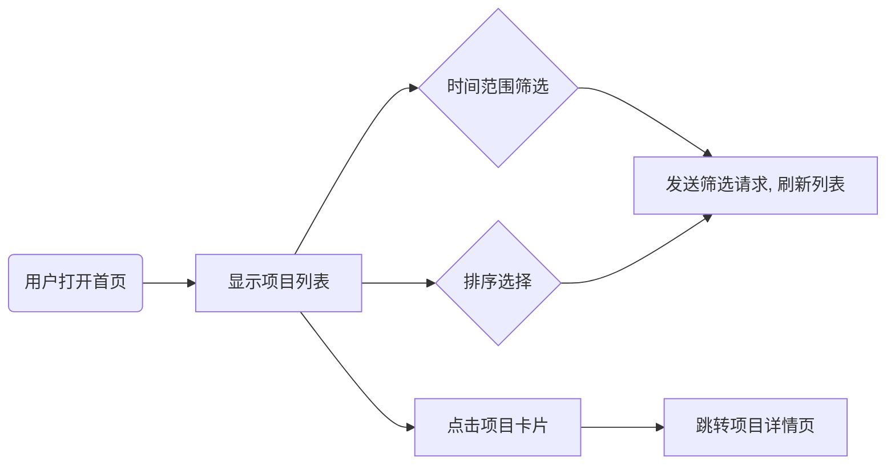

# 执行摘要  
本项目旨在为2026届计算机专业毕业生设计一个“AI热门开源项目聚合平台”。系统实时自动抓取GitHub等平台上的AI相关热门仓库（支持每日/周/月/年热度），以新闻流形式呈现，支持按时间范围（今天/本周/本月/近一年/自定义）和star数升降序筛选、自动去重，并利用AI模型（如Google Gemini、ChatGPT/Codex等）生成或翻译项目简介为简体中文。报告详细阐述了项目目标、核心功能、用户故事、系统架构（后端抓取管道、数据库设计、索引策略、去重与排序算法、缓存）、API设计、前端界面草图与交互流程、部署运维建议（云平台、CI/CD、监控）、测试计划、分阶段时间表（MVP与扩展），并给出针对简历/项目展示的示例文案。推荐使用Google Stitch（UI设计）、Gemini（LLM）、AI Studio（vibe coding）、ChatGPT/Codex（代码生成）和Trae（AI IDE）等工具，并补充必要的开源框架、数据库（如PostgreSQL/MongoDB）、爬虫库（Puppeteer/BeautifulSoup）和翻译模型。关键细节包括GitHub API调用示例与速率限制【13†L323-L332】【18†L240-L247】、增量爬取伪代码、star排序和时间窗口计算方法，以及中文简介生成/翻译的提示词及示例输入输出。  

## 项目目标  
- **实时热点采集**：自动抓取AI相关热门开源项目（例如GitHub每日/周/月/年热门）并更新数据。  
- **动态新闻流展示**：以类似社交媒体的新闻流形式展示项目列表，提供流畅的滚动浏览体验。  
- **多维度筛选排序**：支持按时间范围（今天/本周/本月/近一年/自定义）过滤项目，并按star数升序或降序排序。  
- **去重与更新**：自动识别并去除重复项目（同一仓库只展示一次），并定期增量更新已有项目数据。  
- **中英文简介**：自动生成或翻译项目简介为简体中文，提高国内用户易读性。  
- **项目详情**：可点击查看项目详情页，展示完整介绍、作者、链接等信息。  

## 核心功能清单  
- **数据抓取模块**：定时（如每小时/每天）从GitHub Trending页面或使用GitHub Search API抓取AI相关项目列表。  
- **数据库存储**：将抓取到的项目信息（名称、作者、描述、star数、URL、抓取时间等）存入数据库，并对必要字段建立索引。  
- **去重算法**：按项目唯一ID（如“owner/repo”）去重，保留最新记录。  
- **排序筛选接口**：后端API支持按时间区间和星数排序查询，并可指定升/降序。  
- **缓存机制**：使用Redis等缓存热点查询结果，提升响应速度和并发性能。  
- **AI简介生成**：调用Google Gemini或ChatGPT，根据项目原英文简介生成或翻译出简练的中文简介。  
- **前端显示**：新闻流式列表展示项目，每条包含项目名称、简介（中文）、star数、更新时间等；详情页显示完整信息。  
- **交互控件**：时间范围选择器（如下拉菜单/按钮组）、排序切换（升序/降序切换按钮）、搜索/关键词过滤（可选）、分页或无限滚动等。  
- **部署运维**：部署在云平台（如Google Cloud Run/AWS Lambda），集成CI/CD流水线，并配置监控告警。  

## 用户故事  
- 作为**AI领域应届生**，我希望浏览当前最热门的AI开源项目，以便了解行业趋势并挑选项目案例放入简历。  
- 作为**普通用户**，我需要按“今天/本周/本月/近一年”等时间范围筛选项目，查看近期热点。  
- 作为**技术经理**，我希望项目列表支持按star数升降序排序，以便发现最受关注或最具潜力的项目。  
- 作为**中国用户**，我希望看到每个项目的中文简介，而非直接阅读英文，以提高信息获取效率。  
- 作为**站点维护者**，我希望系统能自动去重和定期更新，不需要手动维护项目列表。  

## 系统架构  

**总体设计**：系统分为后端抓取管道与前端服务两部分。后端定时任务从数据源（主要为GitHub Trending页面或Search API）抓取项目数据，进行去重和存储；前端和后端通过REST API交互，前端呈现项目新闻流及筛选控件。后端使用数据库存储项目记录，并对`star_count`和`fetch_date`等字段建立索引，加速排序和筛选查询。Redis等缓存用于存储频繁访问的数据或热点查询结果，减少数据库压力。AI生成模块调用Gemini/ChatGPT等大型语言模型生成或翻译项目简介。系统架构示意如下：  

```mermaid
graph LR
    subgraph 后端抓取与存储
        Cron[定时调度(Cron)] --> Scraper[项目抓取模块]
        Scraper --> DB[(项目数据库)]
    end
    subgraph 应用服务
        用户 --> UI[前端界面]
        UI --> API[后端API服务]
        API --> DB
        API --> Cache[(Redis缓存)]
        API --> AI[AI模型（Gemini/ChatGPT）]
    end
    Scraper -->|调用| GitHub[GitHub API/Trending 页面]
```

### 后端抓取管道  
- **数据源选择**：优先抓取GitHub Trending页面（日/周/月）的项目列表【20†L277-L285】。由于GitHub无正式热点API，只能爬取Trending页面或使用爬虫库（如Puppeteer、Playwright）解析HTML【20†L277-L285】。也可备选方案：利用GitHub搜索接口筛选近一段时间内创建并按star排序的仓库【20†L137-L140】（示例见下）。  
- **抓取流程**：使用定时任务（如Linux Cron或云函数定时触发）启动抓取脚本。脚本遍历所需时间段（当天、本周、本月等）的Trending页面，提取每个项目的名称、描述、star数、链接等，并调用GitHub API获取详细信息（如README片段）。  
- **增量更新**：记录上次抓取时间，后续抓取仅获取新增或更新的仓库信息，避免重复全量抓取。可在数据库中记录每个项目的最后抓取时间，并仅更新自上次抓取以来star数或描述有变化的项目。  

示例：使用GitHub搜索获取近7天最受star的“AI”相关项目：  
```bash
curl -G https://api.github.com/search/repositories \
  --data-urlencode "q=topic:AI created:>$(date -v-7d '+%Y-%m-%d')" \
  --data-urlencode "sort=stars" --data-urlencode "order=desc"
```  
该接口返回7天内创建并按star降序的仓库列表【20†L137-L140】。注意搜索接口对每分钟请求次数有限制（认证后约30次/分钟【18†L240-L247】）。  

### 数据库设计与索引策略  
- **表结构**：设计项目表（Projects），字段示例：`id`（主键）, `repo_full_name`（所有者/仓库名，唯一索引），`name`, `owner`, `description_en`, `description_cn`, `star_count`, `language`, `url`, `fetched_at`（抓取时间）等。可根据需要再设计用户表（User）用于访问权限。  
- **索引策略**：对`repo_full_name`建唯一索引保证去重。对`star_count`和`fetched_at`字段建立索引，以加速排序和时间筛选查询。对于时间筛选（如“近一年”），查询时使用`WHERE fetched_at >= 某时间`，并结合索引高效检索。  
- **去重算法**：每次抓取或更新时，以`repo_full_name`为键判断项目是否已存在。伪代码：  
  ``` 
  for each project in scraped_data:
      key = project.owner + "/" + project.name
      if DB.exists(key):
          // 如需要可更新star_count或描述（视需求而定）
          DB.update(key, star_count=project.star, description_en=project.desc, fetched_at=now)
      else:
          DB.insert(key, project fields...)
  ```  
  这样可保证同一仓库只保存一条记录，后续抓取时只更新相关字段而不会重复插入。  

### 排序策略与缓存  
- **排序查询**：后端API支持按星数升序/降序返回项目，可直接利用数据库的`ORDER BY star_count ASC/DESC`。对于大数据量，可限制返回数量分页。  
- **缓存**：对于热门查询（如默认“今日”、“本周”热点），可使用Redis等内存缓存保存查询结果，定期刷新。例如，每小时更新一次今天、本周的数据缓存，用户访问时直接读取缓存，提高响应速度并降低数据库压力。  

### 系统接口设计  
设计RESTful API供前端调用，示例接口：  
- `GET /api/projects?range={today|week|month|year|custom}&sort={stars_asc|stars_desc}&page={n}`：获取筛选后的项目列表，返回JSON数组；  
- `GET /api/projects/{owner}/{repo}`：获取单个项目详情，包括英文&中文简介、完整README片段、相关链接等；  
- `GET /api/status`：健康检查接口，返回服务状态。  

## 前端界面草图与交互流程  
前端采用响应式设计，参考新闻流（News Feed）风格，每个项目以卡片形式展示（包含项目名、项目简介（中文）、star数、编程语言、更新时间等）。**筛选控件**布置在列表顶部或侧边：时间范围选择器（下拉菜单或标签页：今天/本周/本月/近一年/自定义）、排序切换按钮（星数升序/降序）。可提供搜索框按关键词过滤（可选）。  

用户交互流程如下：  



示意说明：用户访问首页后看到默认列表（例如“今天”热点）。若选择不同时间范围或排序方式，前端向后端API发起请求并更新列表。点击某项目卡片后进入详情页，展示完整信息和原始链接等。  

**UI 设计工具**：可使用Google Stitch进行原型设计。Stitch允许使用中文或英文自然语言描述界面，自动生成多屏界面草图【29†L84-L87】。然后将设计导入Google AI Studio的Build模式，Gemini可根据设计自动生成对应的React/HTML代码【29†L154-L156】【29†L162-L166】。例如在Stitch中提示“设计一个AI项目列表首页界面：卡片式布局，顶部有时间筛选标签和排序按钮”，即可快速得到UI草图；再在AI Studio中载入该设计，Gemini生成前端代码，提高迭代效率。Trae等AI代码助手也可辅助实现交互逻辑代码。  

## 部署与运维  
- **云平台**：推荐使用Google Cloud（与Stitch/Gemini/AI Studio生态一致）。可将后端部署在Cloud Run或Compute Engine，前端部署在Cloud Run或Firebase Hosting；也可使用AWS Lambda+API Gateway或Heroku等。  
- **CI/CD**：使用GitHub Actions（或Google Cloud Build）构建流水线：代码提交触发自动测试、静态检查，成功后自动部署到云端。采用Docker容器化部署可增强可移植性。  
- **监控与日志**：使用云平台监控（Google Cloud Monitoring/AWS CloudWatch）跟踪运行时指标（CPU、内存、响应时间等）。日志系统（如Stackdriver Logging/Sentry）记录错误和请求日志，设置告警（如错误率升高触发邮件）。  
- **可扩展性**：使用自动扩缩容组件（如Cloud Run实例自动扩容），以应对并发峰值。数据库使用托管服务（如Cloud SQL、AWS RDS），配置读写分离或只读副本保证高并发访问。Redis使用托管的MemoryStore/ElastiCache提升吞吐。  

#### 工具/数据库/部署对比表  

| 项目类别     | 选项               | 优势                                                  | 劣势               | 备用方案            |
|------------|------------------|-----------------------------------------------------|------------------|-------------------|
| **UI设计**   | Google Stitch    | AI生成高保真界面草图，按自然语言提示快速迭代【29†L84-L87】           | 新工具需学习使用      | Figma（成熟工具，但需人工设计） |
| **后端框架** | Node.js + Express | 社区成熟、生态丰富，JavaScript全栈；易集成多种包               | 单线程模型需注意并发  | Python/Django（语法简洁，生态成熟） |
| **数据库**   | PostgreSQL       | 关系型数据库，支持复杂查询和事务；易索引排序                 | 配置和维护相对复杂    | MySQL/MariaDB（同属关系型），MongoDB（文档型，灵活但无JOIN） |
| **缓存**    | Redis            | 内存缓存速度快，支持丰富数据结构；社区成熟                  | 占用内存资源        | Memcached（简单键值缓存）   |
| **爬虫/调度** | Puppeteer/BeautifulSoup + Cron | 可抓取动态页面；自由度高；策略可定制                         | 开发复杂度较高       | Apify平台（简化爬取，但第三方服务） |
| **AI模型**   | Google Gemini    | 与Google生态无缝对接，可生成/翻译中文简介【29†L154-L156】        | 需Google账号和API权限 | ChatGPT/GPT-4（通用性强，无需本地部署） |
| **代码助手**  | Trae             | AI驱动IDE，可自动完成代码段；集成多模型                        | 新兴工具，社区小     | GitHub Copilot（VSCode插件）、OpenAI Codex |
| **部署平台**  | Google Cloud Run | 与AI Studio集成好；支持自动扩缩容；按使用付费                    | 学习曲线；部分地域服务差异 | AWS Lambda/API Gateway（普及度高），Heroku（部署简单） |
| **CI/CD**   | GitHub Actions   | 与代码仓库集成，市场上插件丰富；免费额度足                   | 大型项目可能复杂     | GitLab CI/CD、Jenkins（自托管） |

## 测试计划  
- **单元测试**：为后端抓取逻辑、数据库操作、API接口等编写单元测试，确保函数正确性。使用测试框架如Jest（Node.js）或PyTest（Python）。  
- **集成测试**：模拟抓取任务，验证数据从爬虫到数据库再到API的完整流程；验证去重、排序、过滤逻辑正确。可使用模拟的GitHub API响应（Mock）。  
- **前端测试**：使用Jest/Enzyme或Playwright/Selenium等，对前端组件和端到端流程进行测试，例如筛选功能、详情跳转。  
- **性能测试**：模拟高并发请求，测试API响应时间和数据库负载；测试GitHub API速率限制处理（如遇到`403`或`429`错误时执行重试和退避）。  
- **安全测试**：对输入（如自定义筛选参数）做校验，防止注入；确保使用HTTPS，保护数据传输；对API限速，防止滥用。  
- **可用性测试**：用户体验测试，收集反馈改进UI。  

## 时间表（MVP分阶段）  
1. **阶段一（1-2周）**：需求分析与环境搭建。确认技术选型（前端框架、后端语言、数据库）；搭建代码仓库和CI/CD。设计数据库Schema。  
2. **阶段二（2-3周）**：实现后端抓取管道。完成GitHub Trending页面爬虫或搜索API接口，保存数据到数据库。验证去重功能。  
3. **阶段三（1-2周）**：开发后端API。实现按时间范围和star排序的查询接口，加入分页。并行实现缓存逻辑。  
4. **阶段四（2-3周）**：前端页面开发。使用Stitch/AI Studio快速设计UI，并手动或AI辅助生成前端代码，实现列表显示、筛选控件和详情页样式。  
5. **阶段五（1-2周）**：集成AI简介生成模块。设计提示词（见下）调用Gemini/ChatGPT生成中文简介，保存到数据库并展示。  
6. **阶段六（1周）**：部署与测试。将应用部署到云平台，配置CI/CD自动化，编写测试用例并执行。优化性能和用户体验。  
7. **扩展功能**：如时间允许，可加入用户登录收藏、更多数据源（如GitLab Trending）、复杂搜索、移动端适配等。  

## 中文简介生成示例  
使用AI模型自动生成或翻译项目简介，可设计如下提示词（示例以ChatGPT为例）：  
- **示例输入**（英文原文）：“Extract prominent colors from an image. JS port of Android’s Palette.”【20†L156-L162】  
- **翻译提示**（中文）：“请将以下英文项目简介翻译并润色成简体中文：`Extract prominent colors from an image. JS port of Android’s Palette.`”  
- **输出示例**：“这是一个用于从图像中提取主要颜色的JavaScript库，原项目基于Android系统的Palette类移植而来。”  

- **示例输入**：“A virtual DOM implementation with hooks for building frontend UIs.”  
- **生成提示**：“根据以下项目简介，用简洁中文表述该项目功能：`A virtual DOM implementation with hooks for building frontend UIs.`”  
- **输出示例**：“这是一个带有钩子的虚拟DOM实现，用于构建前端用户界面。”  

提示词中可根据需要指定“字数限制”、“语气”等，例如：“请使用简短流畅的句子描述项目功能”。  

## 简历/项目展示文案模板  
示例格式如下，可以根据实际情况调整：  
- **项目名称**：AI热门开源项目聚合平台  
- **项目简介**：开发了一个实时抓取AI相关热点GitHub项目并展示的平台，支持按时间范围和star排序筛选，并自动生成中文项目简介。  
- **技术栈**：React + TypeScript 前端；Node.js/Express 后端；MySQL（或MongoDB）数据库；Redis缓存；Google AI工具（Stitch、Gemini、AI Studio）；OpenAI Codex/ChatGPT；云平台部署（Google Cloud Run）。  
- **我的职责**：负责系统架构设计、后端爬虫与API开发、数据库设计与优化；前端界面设计与实现；集成Gemini/ChatGPT进行项目简介生成；配置CI/CD流水线和监控；编写项目文档及简历展示材料。  

该模板可直接用于简历项目经验描述，突出核心功能和所用技术。  

**参考资料：**以上设计方案参考了GitHub官方文档（如API速率限制说明【13†L323-L332】【18†L240-L247】）、Google官方与社区资源（Stitch/AI Studio介绍【29†L84-L87】【29†L154-L156】、Codex能力说明【31†L63-L71】等），确保内容准确详尽。